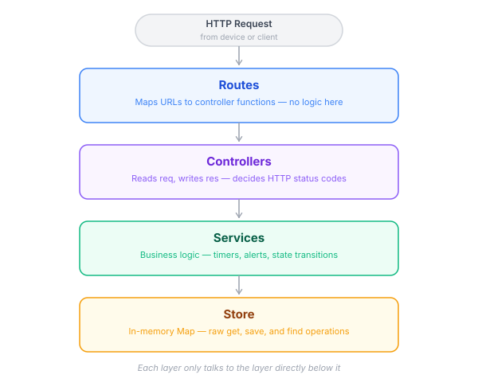
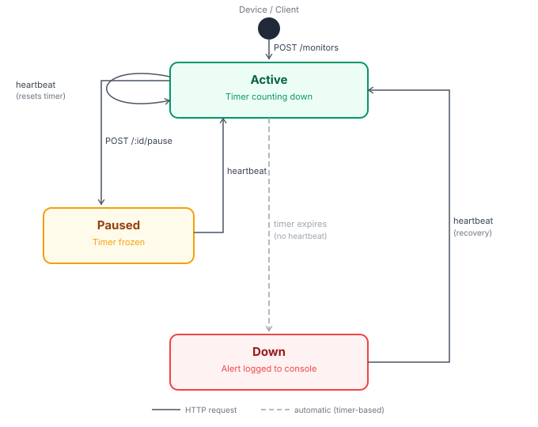

# Pulse Check API — Dead Man's Switch Sentinel

A backend service that monitors remote devices by tracking periodic heartbeat signals. If a device goes silent, the system automatically fires an alert. Built with Node.js, Express, and TypeScript.

---

## Project Structure

```
pulse-check-api/
├── src/
│   ├── types/
│   │   └── monitor.types.ts      # Interfaces, types, DTOs
│   ├── store/
│   │   └── monitorStore.ts       # In-memory data store
│   ├── services/
│   │   └── monitorService.ts     # Business logic & timer management
│   ├── controllers/
│   │   └── monitorController.ts  # HTTP request/response handling
│   ├── routes/
│   │   └── monitors.ts           # URL route definitions
│   └── server.ts                 # Express app entry point
├── docs/
│   ├── architecture.svg
│   └── flowchart.svg
├── .gitignore
├── package.json
└── tsconfig.json
```

## Layered Architecture

The codebase is split into four layers. Each layer has one responsibility and only communicates with the layer directly below it.



---

## System Flow & State Machine

Every monitor lives in one of three states: **Active**, **Paused**, or **Down**. The diagram below shows which HTTP endpoints drive each transition, and which transitions happen automatically via the timer.



---

## Setup Instructions

### Prerequisites

- Node.js v18 or higher
- npm v8 or higher

### Installation

```bash
# 1. Clone the repository
git clone <your-repo-url>
cd pulse-check-api

# 2. Install dependencies
npm install

# 3. Start the development server
npm start
```

The server starts on `http://localhost:4000` by default.

To use a different port:

```bash
PORT=8080 npm start
```

### Available Scripts

| Command              | Description                               |
| -------------------- | ----------------------------------------- |
| `npm start`          | Run the server with ts-node (development) |
| `npm run build`      | Compile TypeScript to `/dist`             |
| `npm run start:prod` | Run the compiled output (production)      |

---

## API Documentation

### Base URL

```
http://localhost:4000
```

### Endpoints Overview

| Method | Endpoint                  | Description                   |
| ------ | ------------------------- | ----------------------------- |
| GET    | `/`                       | Health check                  |
| POST   | `/monitors`               | Register a new monitor        |
| POST   | `/monitors/:id/heartbeat` | Reset a monitor's countdown   |
| POST   | `/monitors/:id/pause`     | Pause a monitor's timer       |
| GET    | `/monitors/:id`           | Get a single monitor's status |
| GET    | `/monitors/:id/history`   | Get a monitor's alert history |
| GET    | `/monitors`               | Get all monitors              |

---

### GET `/`

Health check to confirm the server is running.

**Request**

```http
GET http://localhost:3000/
```

**Response `200 OK`**

```json
{ "message": "You are a dead man, unless you ping!!!" }
```

---

### POST `/monitors`

Registers a new device monitor and starts its countdown timer. If a monitor with the same ID already exists, it is replaced and its old timer is cancelled.

**Request**

```http
POST http://localhost:3000/monitors
Content-Type: application/json

{
  "id": "device-123",
  "timeout": 60,
  "alert_email": "admin@critmon.com"
}
```

| Field         | Type   | Required | Description                                  |
| ------------- | ------ | -------- | -------------------------------------------- |
| `id`          | string | Yes      | Unique device identifier                     |
| `timeout`     | number | Yes      | Seconds before alert fires if no heartbeat   |
| `alert_email` | string | Yes      | Email to notify on alert (logged to console) |

**Response `201 Created`**

```json
{
  "message": "Monitor for device-123 created",
  "monitor": {
    "id": "device-123",
    "timeout": 60,
    "alertEmail": "admin@critmon.com",
    "status": "active",
    "createdAt": "2025-05-25T10:00:00.000Z",
    "lastHeartbeat": "2025-05-25T10:00:00.000Z",
    "alertHistory": []
  }
}
```

**Response `400 Bad Request`** — if any required field is missing

```json
{ "error": "id, timeout, and alert_email are required" }
```

---

### POST `/monitors/:id/heartbeat`

Resets the countdown timer for an existing monitor. If the monitor was paused, this also resumes it. If the monitor was down, this brings it back to active and stamps the `resolvedAt` time on the last alert event.

**Request**

```http
POST http://localhost:3000/monitors/device-123/heartbeat
```

No request body needed — the device ID in the URL is sufficient.

**Response `200 OK`**

```json
{
  "message": "Heartbeat received for device-123",
  "monitor": {
    "id": "device-123",
    "timeout": 60,
    "alertEmail": "admin@critmon.com",
    "status": "active",
    "lastHeartbeat": "2026-05-25T23:47:23.171Z"
  }
}
```

**Response `404 Not Found`** — if the device ID does not exist

```json
{ "error": "Monitor device-123 not found" }
```

---

### POST `/monitors/:id/pause`

Freezes a monitor's countdown timer completely. No alert will fire while the monitor is paused. Sending a heartbeat automatically resumes the monitor and restarts the timer from the full timeout value.

**Request**

```http
POST http://localhost:3000/monitors/device-123/pause
```

No request body needed.

**Response `200 OK`**

```json
{
  "message": "Monitor device-123 paused",
  "monitor": {
    "id": "device-123",
    "timeout": 60,
    "alertEmail": "admin@critmon.com",
    "status": "paused",
    "lastHeartbeat": "2026-05-25T23:47:23.171Z"
  }
}
```

**Response `404 Not Found`**

```json
{ "error": "Monitor device-123 not found" }
```

---

### GET `/monitors/:id`

Returns the current state of a single monitor.

**Request**

```http
GET http://localhost:3000/monitors/device-123
```

**Response `200 OK`**

```json
{
  "id": "device-123",
  "timeout": 60,
  "alertEmail": "admin@critmon.com",
  "status": "active",
  "createdAt": "2025-05-25T10:00:00.000Z",
  "lastHeartbeat": "2025-05-25T10:01:05.000Z",
  "alertHistory": []
}
```

**Response `404 Not Found`**

```json
{ "error": "Monitor device-123 not found" }
```

---

### GET `/monitors/:id/history` _(Developer's Choice)_

Returns the full alert history for a device, including when each outage occurred, when the device recovered, and how long it was offline each time.

**Request**

```http
GET http://localhost:3000/monitors/device-123/history
```

**Response `200 OK`** — device that went down and recovered

```json
{
  "id": "device-123",
  "totalAlerts": 2,
  "history": [
    {
      "alertTime": "2025-05-25T10:00:00.000Z",
      "resolvedAt": "2025-05-25T11:03:22.000Z",
      "offlineDuration": "3802s",
      "message": "Device device-123 failed to heartbeat within 60s"
    },
    {
      "alertTime": "2025-05-25T14:00:00.000Z",
      "resolvedAt": null,
      "offlineDuration": "ongoing",
      "message": "Device device-123 failed to heartbeat within 60s"
    }
  ]
}
```

| Field             | Description                                            |
| ----------------- | ------------------------------------------------------ |
| `alertTime`       | When the alert fired (device went down)                |
| `resolvedAt`      | When the device came back online. `null` if still down |
| `offlineDuration` | Time offline in seconds. `"ongoing"` if still down     |
| `message`         | Description of the failure                             |

**Response `404 Not Found`**

```json
{ "error": "Monitor device-123 not found" }
```

---

### GET `/monitors`

Returns all registered monitors and their current states.

**Request**

```http
GET http://localhost:3000/monitors
```

**Response `200 OK`**

```json
[
  {
    "id": "device-123",
    "status": "active",
    "timeout": 60,
    "alertEmail": "admin@critmon.com",
    "createdAt": "2025-05-25T10:00:00.000Z",
    "lastHeartbeat": "2025-05-25T10:01:05.000Z",
    "alertHistory": []
  },
  {
    "id": "device-456",
    "status": "down",
    "timeout": 30,
    "alertEmail": "ops@critmon.com",
    "createdAt": "2025-05-25T09:00:00.000Z",
    "lastHeartbeat": "2025-05-25T09:30:00.000Z",
    "alertHistory": [
      {
        "time": "2025-05-25T09:30:30.000Z",
        "resolvedAt": null,
        "offlineDuration": "ongoing",
        "message": "Device device-456 failed to heartbeat within 30s"
      }
    ]
  }
]
```

---

## Alert Behaviour

When a monitor's timer expires without receiving a heartbeat, the system logs the following to the console:

```json
{
  "ALERT": "Device device-123 is down!",
  "alertEmail": "admin@critmon.com",
  "time": "2025-05-25T10:01:00.000Z"
}
```

In a production system this would trigger a webhook, send an email via a service like SendGrid, Resend or push a notification to an on-call platform like PagerDuty.

---

## Developer's Choice — Alert History with Offline Duration

### What I added

A `GET /monitors/:id/history` endpoint that returns a full log of every time a device went down, when it recovered, and exactly how long it was offline for each incident.

### Why I added it

The core spec fires an alert when a device goes silent — but says nothing about what happens after. Once a device recovers and its status flips back to `active`, there is no trace of the outage.

In a real infrastructure monitoring context, this creates a blind spot. A support engineer responding to an incident needs to know:

- Has this device gone down before?
- How long was the last outage?
- Is this a recurring pattern or a one-off?

Without history, every incident looks like the first one, and post-incident reports are impossible to write accurately.

The history endpoint solves this by recording an `AlertEvent` every time the alert fires, and stamping a `resolvedAt` timestamp when the device sends its next heartbeat from a `down` state. The `offlineDuration` is computed server-side so clients do not need to calculate it themselves.

---

## Design Decisions

**In-memory storage** — monitors are stored in a JavaScript `Map` rather than a database. Data does not persist across server restarts. The store layer is fully isolated, so swapping in Redis or PostgreSQL will be quite easy and straightforward.

**Layered architecture** — types, store, service, controller, and routes each have one responsibility and only talk to the layer below. This makes every piece independently testable and replaceable without touching the rest of the system.

**`timerHandle` never exposed to clients** — the `SafeMonitor` type uses TypeScript's `Omit` utility to strip `timerHandle` from any object the API returns. It is a Node.js internal implementation detail with no meaning outside the server process.
